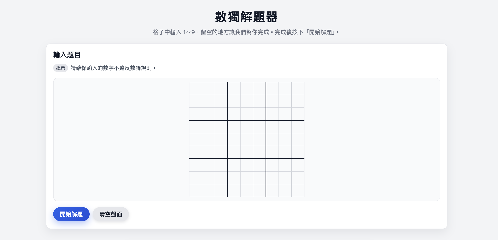

# Sudoku Solver



A browser-based Sudoku solver built with **Flask** and powered by a recursive backtracking algorithm.  
Users can enter a Sudoku puzzle in the web interface, submit it, and receive a solved grid along with the execution time.

---

## Overview

This project provides:

- A clean web interface for entering Sudoku puzzles
- A Python backtracking solver (`SudokuSolver`) that processes the board
- Automatic detection of invalid or unsolvable puzzles
- Execution time measurement
- Visual display of the completed solution

The backend uses the logic from `sudoku.py`, integrated into a Flask web application.

---

## Installation

Require **Python 3.10** or higher.

Install required dependencies:

```bash
pip install -r requirements.txt
```

## Running the Application

Start the Flask server:

```bash
python app.py
```

Access the web interface at <http://127.0.0.1:12345/>

---

## Demo

<https://github.com/user-attachments/assets/2dc26ad4-a95f-44ec-9197-e59bd43bd138>
